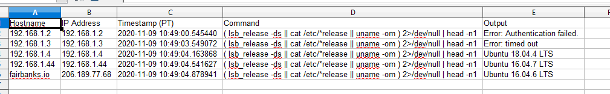

### Sys-Info

Ansible like script to run a command on multiple systems and gather outouot in CSV

#### Setup

- Ensure that Python 3.6+ is available
- Install the Python SSH client Paramiko: `pip3 install paramiko`
- Create/Edit *hosts.txt* with IPs/Hosts one per line
- Run `python3 sys-info.py -u myuser` to get started or `python3 sys-info.py --help` for more options.

#### Output

